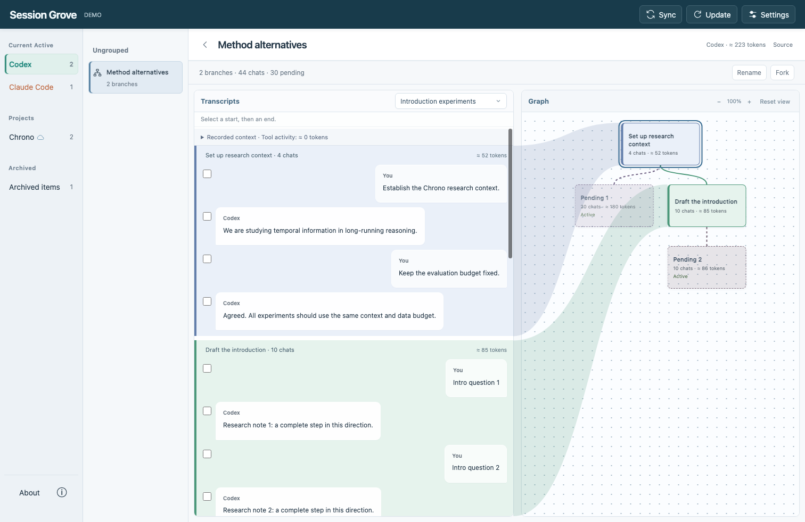

# Session Grove

[English](README.md) | **简体中文**

**你的 AI 对话已经长成一棵树，不应该只能在一长串聊天列表里寻找它。**

Session Grove 是面向 **Claude Code 和 Codex** 的项目式会话管理工具。你继续在 CLI 或 VS Code 插件里与 Agent 对话；在 Grove 中整理对话历史、保存有用的上下文、管理分支，并通过自己的 WebDAV 在另一台 Mac 上接着工作。



## 当聊天列表开始妨碍工作

你花了一段时间建立上下文，分叉去试另一个想法，又分叉去写 Introduction、调试实现或探索新方法。最后原生列表里塞满了相似的会话。你记得做过什么，却不记得在哪条 session 里。

Grove 给这些工作一个清楚的结构：

- **按项目放在一起。** 一篇论文、一个代码仓库或一项研究，都可以有自己的 Project。共享前缀的会话折叠为一棵树。内部子 agent 与空会话不会混入列表。
- **为工作片段命名。** “建立背景”“完成引言”“测试另一种方法”，都可以成为逻辑 Node。新对话留在 Pending，等你有空再整理。
- **对照阅读正文与分支图。** Transcript 与 Graph 并排展示，颜色与色带对应实际对话和逻辑节点。
- **决定从哪种上下文继续。** 可以使用已记录的压缩结果，也可以恢复压缩前的记录。图会弱化被压缩替代的历史；选择在激活或显式应用上下文时生效。
- **让原生列表只保留正在用的内容。** 激活需要的路径；归档完成的路径。公共前缀不会丢，仍在用的分支不会一起被隐藏。
- **换一台 Mac 继续。** 项目通过你的 WebDAV 同步。先加载目录，打开具体树时再按需下载上下文。

Grove 管理会话资料库，**Codex 和 Claude Code 仍负责实际对话**。它不替代编辑器插件，也不会替你发送模型请求。

## 日常使用

1. 在 Codex 或 Claude Code 里开始对话，回到 Grove 点击 **Update**。
2. 日常会话可以一直留在 **Ungrouped**；项目相关的整棵树再用 **Move** 归入项目，两者都会同步。
3. 打开树，点击一条对话作为起点，再点击终点，中间内容自动选中。**Combine** 把它命名为一个节点，**Dissolve** 让所选内容回到 Pending。
4. 选中图节点可直接 **Rename**。给 Pending 命名后，它就成为正式节点。节点结束于完整轮次时才出现 **Fork**。
5. 选中 session 的末端，才能激活、停用或归档这条路径。归档区会保留它的完整前缀；在用图里只保留还在用的路径。
6. 继续在原生客户端对话，新增内容会进入 Pending。整理节点后自动上传；暂时不想整理，也可以点击 **Sync** 把剩余 Pending 一起同步。

大图支持拖拽平移、缩放和复位，Sankey 色带只连接视口内的内容。

按钮只在当前选择适用时出现。语言切换、WebDAV 配置、操作帮助和诊断记录统一放在 **Settings**。

## 启动

需要 **Node.js 24+**。先 `pnpm install` 安装锁定版本的 Claude 官方 SDK，无需构建。

```sh
git clone https://github.com/MRziyi/session-grove.git
cd session-grove
pnpm install
pnpm run demo
```

打开 **http://127.0.0.1:7421**。演示模式只使用示例数据，不读取个人会话。

要管理真实会话，先停止演示，再运行：

```sh
pnpm dev
```

也可以使用 `npm run demo`、`npm run dev` 和 `npm test`。界面默认英文，在 Settings 中切换中文。

## 上下文留在你自己的存储里

WebDAV 可选，不配置也能在本机整理。配置并解锁后，归入项目、命名节点等整理操作自动触发上传；原生新增对话只先收纳到本机，不会每条回复都上传。

**Sync** 统一完成同步：先 Pull 拉取服务器变更，再 Push 推送本地变更，包括未整理的 Pending。大批量传输先预览确认，随后在独占进度窗口显示方向、进度和 ETA。不同设备的 Active 选择彼此独立。有改动后默认开启 15 分钟兜底同步倒计时，本地默认每 1 分钟读取，均可设置。

原始会话记录会保留。节点编辑只调整整理关系，不改写对话内容。内容加密可选；启用时上传前加密，未启用时显示黄色状态。已保存的凭据和口令保存在仅当前用户可读的本机文件，供下次启动自动连接。

## 当前范围

**0.10.0，实验性版本，优先 macOS。** 支持同工具分叉、跨设备续接和完整/精简两种跨工具上下文转换。

修改原生激活状态目前需要先关闭运行中的 Agent。Codex 已用真实可执行程序验证读取与恢复；Claude 读取和 fork 已用官方 SDK 对照 32 条本机会话、111 个检查点；这不等于复制模型内部状态。WebDAV 已通过隔离协议测试与真实 Teracloud 往返测试；其他供应商可能存在差异。

Token 数是估算值。激活前会参考原生统计和本机可读取的上下文容量配置，接近上限时给出提示。

## 测试与反馈

遇到问题时，记录你选了什么、点击了什么，以及界面中的错误编号。**ⓘ Information → Diagnostics → Download diagnostics** 可以导出操作类型、耗时和错误编号，不含对话正文或凭据。

```sh
pnpm test
```

[部署、数据位置和排错](docs/operations.md) · [交互规则](docs/interaction-model.md) · [上下文与同步细节](docs/context-and-sync.md) · [同步触发与开销实测](docs/sync-policy.md) · [技术选择](docs/technology.md)

设计参考：[codex-session-sync](https://github.com/shonngithub/codex-session-sync)、[claude-sync](https://github.com/tawanorg/claude-sync)、[Chronicle](https://github.com/geekmuse/chronicle)。

[MIT License](LICENSE)


### 设置、同步与上下文保真（0.7）

WebDAV 地址右侧固定显示 `/Session-Grove/`，由系统自动添加。先验证 URL、账号和密码，再选择是否启用内容加密；已保存的密码和口令均用掩码显示。修改地址或口令时，界面显示迁移与逐项校验进度。凭据保存在本机仅用户可读的文件中，供 `pnpm dev` 自动连接；未接入 macOS 钥匙串。

默认每 **1 分钟**读取本地会话，有改动后开启 **15 分钟**兜底上传倒计时（包括 Pending）。每次上传前强制读取本地，没有改动时不产生定时云请求。两个时间均可在设置中调整或关闭。统一 Sync 会先 Pull，再 Push。

Transcript 支持 Markdown，工具调用、工具返回、结构化文件路径和可读推理以折叠记录展示。左下角 **ⓘ 使用说明**放置操作帮助和诊断；**关于**展示版本、开发者和项目链接。

**不能承诺模型请求完全相同。** 支持的组装路径保留原生工具结果、推理、指令及其他记录，不从聊天气泡重建历史。Codex 分页历史现在会解析引用的共同前缀，并保留分页格式激活。已对同一检查点的原生 New branch 和 Grove Fork 做记录及原生读取结果对照；缺失历史段时仍会阻止修改上下文。动态指令、不透明压缩和外部附件仍是边界。详见[需求与保真核对](docs/requirements-audit.md)。


### 日常会话与来源标记

Projects 下固定显示 Ungrouped，汇集各设备未分类的会话。按最近 7 天、最近 30 天、更早分段；旧记录折叠后仍可搜索、展开或批量归档，不自动归档或删除。恢复未分类记录会直接回到 Ungrouped，不自动激活。

列表显示实际工具及最近对话更新的来源设备；图节点保留对应内容的工具标记。仅导入、无法追溯历史设备的记录明确显示导入来源。改标题、整理节点或单纯激活不会冒充新的对话来源。在 session 末端选择“激活为…”可预览完整或精简上下文，并创建具有来源记录的独立目标会话。

上传和 Update 的倒计时每秒更新，隐藏网页或关闭定时器后停止计时刷新；倒计时不会触发服务器请求。

### 首次使用与反馈

新设备不会自动导入：先点击 Update 开启本地读取；配置 WebDAV 后，首次点击 Sync 并确认后才启用完整云端同步。已有加密资料库只要求输入现有口令并解锁，不会同时要求设置新口令。

手动和自动更新期间图标持续旋转，完成后短暂显示绿色勾或错误标志。没有改动的手动同步会提示“已经是最新版本”，不重复上传。定时任务及后台会话默认隐藏，可在设置中选择显示，然后点击 Update。

Fork 生成可选择的空尾节点，并继承当前路径的 compaction 设置。未完成的轮次不能截断工具调用，确认框会说明留在原路径上的对话。推理记录如果只有加密内容，界面会明确标注；Grove 保留原始内容，无法解密不等于组装时丢弃。

### 先 Pull，再 Push

主按钮 **Sync** 统一执行 Pull → Push；顶部进度区和独占窗口显示当前方向、完成数量和估算时间。大量数据会先请求确认，普通自动同步沿用原设置。已验证批次可续传，最终目录只在依赖完整后发布。

### 服务管理与保真验证（0.9）

`pnpm start` 启动，`pnpm status` 查看 PID/地址，`pnpm stop` 停止。前台也可 Ctrl+C；`pnpm dev` 的文件监视器需要在原终端 Ctrl+C。停止会取消常规网络同步，最长等待 10 秒，并保留恢复状态。

[原生 fork、精简策略、性能实测与保真边界](docs/0.9-session-fidelity.md)。

### 统一 Sync 与项目总览（0.10）

顶部统一为一个 **Sync**：先 Pull，再 Push。大型传输先预览确认；进度窗口显示方向、计数和 ETA。项目目录对应右侧连续分组列表，每组默认 5 条，支持展开、目录联动与独立滚动。会话阅读区可折叠两侧目录、调整 transcript/graph 比例。后台会话集中到可隐藏的独立项目，按原生来源识别。

云端改为加密、逐包回读校验的小批次传输；**其他设备需升级到 0.10 才能读取新版云端数据**，旧记录继续可读。详见[设计、兼容性与验证](docs/0.10-workspace-and-sync.md)。
