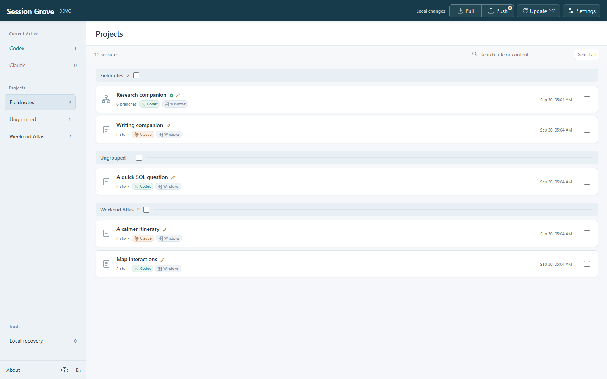
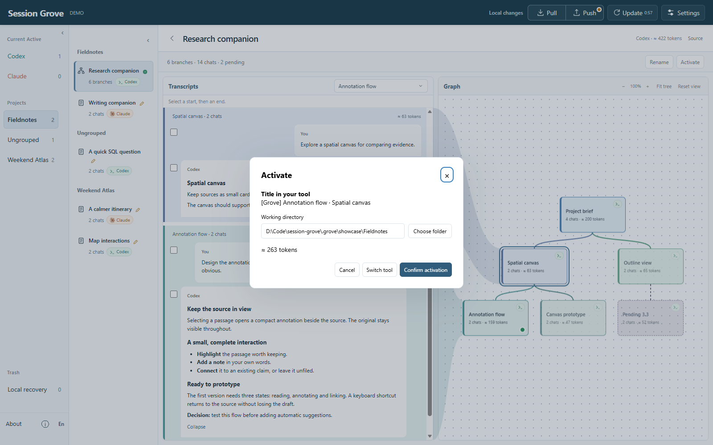

# Session Grove

[English](README.md) · **简体中文**

**留住上下文，探索不同方向，随时回到有价值的工作。**

Session Grove 是面向 **Claude Code 和 Codex** 的本地会话管理工具，支持 Windows 和 macOS。把分散的 AI 对话收进项目，看清思路如何分叉，再从你真正需要的上下文继续。

适合已经长出许多分支的研究、写作和软件项目。


*对话与分支图并排显示。点击一个节点，就能找到它背后的上下文。*

## 当工作不止一个方向

你花了一段时间建立背景，尝试两个方案，完善其中一个，然后又想回到之前的思路。聊天列表里留下许多相似的名字，而真正重要的是它们之间的关系。

| 想做的事 | Grove 如何帮助你 |
| --- | --- |
| 把同一件事收在一起 | 一个 Project 可以同时包含 Claude 和 Codex 会话；有共同历史的对话折叠为一棵树。 |
| 找回有用的思路 | 搜索资料库、阅读原始对话，并为连续的工作片段命名。 |
| 尝试另一个方向 | Activate 所选节点，从对应上下文创建续接，保留已有分支。 |
| 决定带上多少历史 | 预览上下文和 token 估算，选择已记录的压缩结果，或可恢复的压缩前历史。 |
| 换一个工具继续 | Activate as 将所选前缀转为 Claude Code 或 Codex 可读取的会话，可选三种文本保留范围。 |
| 换一台电脑接着做 | 从私有 Git 仓库 Pull 资料库，再把会话激活到本机工作目录。 |

你仍在熟悉的 Agent 中对话，在 Grove 里整理、比较和找回工作。

## 跟着项目走的资料库

用项目收纳持续推进的工作。日常问题先留在 **Ungrouped**，有需要时再归类。工具和设备标记显示对话来源，Active 表示本机客户端中可继续的会话。



新对话会留在 **Pending**。选中一段，命名为“项目背景”“比较方案”或“原型反馈”。这些名称组织历史，不会改写原始对话。

## 从有价值的节点继续

选中节点并点击 **Activate**，即可预览上下文估算、目标目录，以及它在原生工具中显示的名称。在同一个面板选择 **Switch tool**，还可以换一个 Agent 继续。



同工具激活会保留支持的原生记录，包括已记录的工具活动和推理。跨工具转换保存文本表示及来源信息。客户端指令、模型行为、外部文件和不可展开的压缩内容仍可能不同；具体边界见[上下文说明](docs/context-and-sync.md)。

## 少一些整理负担

可选的 **Smart Organization** 会分类、命名新会话，并为新分叉节点起名。填入自己的 OpenAI API key 后，两项功能可以独立开启；已有名称由你掌握。

默认同时处理两个请求，可在 Settings 改为串行或最多四个并发，并设置请求最小间隔。进度会说明正在做什么、还剩多少，以及需要处理的问题。只有启用功能时才会把选取的消息发送给 OpenAI。

Settings 也可以调整 Codex 的上下文窗口和自动压缩阈值，以及 Claude 的自动压缩窗口。留空继承客户端默认值，实际容量仍受模型限制。保存 API key 后输入框禁用，按钮变为 Remove key；删除后恢复录入和验证流程。

## 几分钟试用

准备 **Node.js 24+** 和 Git，然后运行：

```sh
git clone https://github.com/MRziyi/session-grove.git
cd session-grove
pnpm install
pnpm run demo
```

打开 **http://127.0.0.1:7421**。Demo 使用示例会话，不读取个人历史。上面的截图来自真实界面中的合成示例。

管理自己的会话时，先停止 Demo，运行 `pnpm start`，再点击 **Update**。Grove 会读取本机 Claude Code 和 Codex 会话目录。浏览、整理和创建续接时，可以继续运行原生 Agent。

也可以使用 npm：`npm install`、`npm run demo`、`npm start`。左下角可切换中英文。

## 资料在自己手中，工作在设备间继续

需要同步时，在 Settings 连接自己的**私有 Git SSH 仓库**。**Pull** 下载资料库；**Push** 先 Pull，再发布本地修改。默认手动操作，自动上传需要主动开启，各设备独立保留自己的 Active 选择。

本地及同步仓库保存可读历史。项目代码、Agent 凭据和智能整理 API key 不参与同步。Trash 从当前资料库移除会话，并提供可配置期限的本地恢复；旧 Git 提交仍保留历史。

## 继续了解

[部署与排错](docs/operations.md) · [上下文与分支](docs/context-and-sync.md) · [Git 同步](docs/git-sync.md) · [1.0 验证与性能](docs/1.0-windows-validation.md) · [更新记录](CHANGELOG.md)

反馈问题时，请附上选择了什么、发生了什么，以及界面的错误编号。请勿将私密对话或凭据放入公开 issue。

欢迎[反馈问题](https://github.com/MRziyi/session-grove/issues)和贡献。`pnpm test` 运行回归测试，`pnpm test:browser` 运行浏览器验收。

作者：[Ziyi Zhang](https://ziyi-zhang.vercel.app)。设计参考：[codex-session-sync](https://github.com/shonngithub/codex-session-sync)、[claude-sync](https://github.com/tawanorg/claude-sync)、[Chronicle](https://github.com/geekmuse/chronicle)。[MIT License](LICENSE)。
