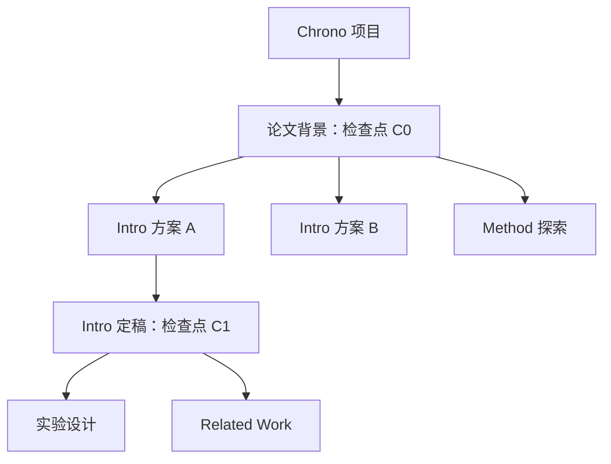
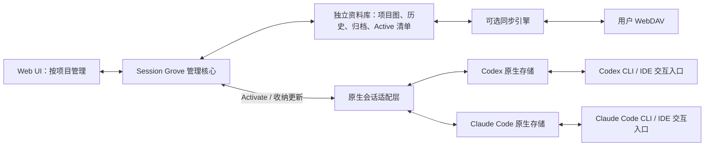

# Session Grove：项目会话管理需求与高层设计

## 0.16 智能整理补充

- 分类与分叉节点命名分别开启，默认关闭，需本机 API key；模型固定为 `gpt-6-luna`。开启不批量改动已有内容。
- 分类等待首条真实用户消息后的 agent 回复；节点首次出现多个孩子时，用该节点首条用户消息和最后一条 agent 文本生成短名。先排除客户端注入信息、工具结果、压缩摘要与错误。用户消息不截断，长回复仅省略中段。
- 模型只修改 Grove 名称和项目归属，不修改原生身份或 transcript。保留手动命名；异步请求期间用户的新操作优先。归属不明确时保留 Ungrouped，避免猜测。
- 模型请求排队在后台执行，不占用 Update 的网络等待，也不禁用本地操作。白盒状态展示具体任务、当前会话、剩余数量与可重试错误，不显示泛泛的 thinking。静态说明进入 Information。
- 密钥和开关只在本机保存，不进入同步数据或浏览器返回值。仅当功能开启时发送选取的文本，设置里明确披露这一点。实现与小样本验证见 [智能整理](0.16-smart-organization.md)。

## 0.15 交互补充

- 进度进入 Pull | Push 按钮本身，不再使用独立进度面板；Push 先填充 Pull，再填充 Push。状态与测量信息放在按钮左侧，所有工具栏按钮保持对齐。百分比是当前阶段测量值，带宽与预计时间只在可用时显示。错误就地展示，长错误可展开且尺寸受限。
- 完成后短暂勾选并淡出填充，恢复可点击的外观；新的本地修改让 Push 显示待推送圆点。无更新的 Pull 明确反馈“已是最新”。
- Pending uploads 与 Git 提交说明共用实际数据差异，列出项目、会话及具体修改类型，不以统一 Modified 掩盖细节。
- 名称属于显示元数据，不能作为原生会话或消息的身份标识。重命名不得触发原生正文重写。Active 状态同时显示在会话列表和图的末端，末端直接提供 Deactivate。
- 操作卡片只保留输入、当前状态和影响当次决策的结果；无状态的常识说明放 Information。不要在设置中解释“不需要某功能”、旧架构或内部实现。按钮共享一行，避免无意义的纵向留白。真实风险和错误应在发生或影响当前决定时给出具体原因。

## 当前技术决策：个人跨设备 Git 同步（0.15）

以下规则覆盖本文后续历史 WebDAV 方案；详细契约见 [Git 同步与迁移](git-sync.md)。

- 以单人轮流使用设备为主要场景，不为低概率团队并发构建复杂协调系统。用 Git 的普通 fast-forward Push 防止覆盖；失败时明确提示重试。
- Git 承担版本历史、压缩、增量传输和引用发布。Grove 只保留 Session 图语义、修改日期、原生工具适配与本地索引，不重新实现 pack 和全库 GC。
- Pull 完成后全部会话已导入本地，不显示云图标或要求二次下载。Push 先 Pull。默认手动操作，可选自动 Push。
- 私有仓库保存可读 JSON / JSONL，通过用户已有 SSH 身份访问；不提供 Grove passphrase 或整库加密打包。
- Trash 只移除当前版本，允许 Git 历史保留。首次迁移排除全部既有 Trash 和 Archive，允许保留其他有效路径必要的共享前缀；恢复保留期不能阻塞同步设计。
- 白盒要求不变：显示具体阶段、当前会话、Git 可提供的进度和速度、可估算时的 ETA、明确错误；没有测量值时不伪造数据。Pull → Push 的阶段点亮必须跟随实际操作。本地操作不被云端网络等待禁用。


日期：2026-09-27。状态：设计基线；已进入实现。代码位于 [实现说明](../README.md)，具体能力与兼容性见其 README；本设计仍包含尚未完成的目标。

> 界面控制流与术语已按新版两页设计实现：见 [交互模型](interaction-model.md)。0.3.0 以该文档为准；本文中冲突的旧导航和分组术语仅作历史设计参考。

## 当前强制设计原则：白盒与本地优先

以下规则优先于本文历史方案。具体状态机见 [同步策略](sync-policy.md)。

- **所有长任务必须可解释，但主面板只展示用户需要的信息。** 不得仅显示 Thinking、Working 或一个无限旋转的图标。传输面板显示实际动作、连续进度、进度条右上方的预计剩余时间和右下方的下载速度；不显示折线图或开发者统计。字节、请求、校验和缓存统计放入 Information。未知总量或时间明确标注，不能伪造百分比。
- **状态、错误和待处理项有固定位置。** Pull / Push 是一个共用外框、只有中间分隔线的控件。两阶段始终并排显示，用箭头连接，不写编号；待执行为灰色，当前阶段点亮并使用对应方向动画，完成为绿色勾选，真实失败为红色且错误信息替代进度条。主动暂停不是失败。浮层按视口定位、限制高度、内部滚动，不能撑开菜单栏。过去的错误不得叠加到正在成功执行的新任务中。
- **图与 transcript 是白盒的一部分。** 路径、节点、token 估算和原生工具标题必须可见；切换路径不能悄悄改变选择或回到根节点。
- **本地操作不依赖云端空闲。** 同步期间仍可 Rename、Activate、Trash、整理节点和收纳新 transcript。云端任务读取不可变版本；本地新操作进入下一待上传状态。不得用全局 syncing 锁禁用本地工作。原生文件正被工具写入时的必要保护仍需明确说明原因。
- **用户掌握网络时机。** 左侧 Pull 手动拉取，右侧 Push 先拉取成功再推送。箭头只沿拉取/推送方向移动，不能旋转下载/上传图标。共享内容准备结束前不能提前点亮 Push。没有独立后台拉取定时器；自动推送默认关闭，主动勾选后才启动倒计时。
- **同一修改时间定义贯穿排序与同步。** Transcript 变化、会话命名、节点新增/改名/重组和路径组织改变均更新会话修改时间。浏览、轮询、下载和校验不能把旧会话变成新会话。较新版本替换较旧版本；相同时间的不同内容保留显式冲突，传输期间新产生的本地修改不得被覆盖。

## 0. 本轮确定的交互模型（0.2）

- 界面默认英文，可切换中文并记住选择。
- 左侧上方为本机 Active 与尚未归类的本机工作；下方为云端项目。设备信息只标注来源，不决定项目结构。
- 已有原生会话自动观察，保持当前 Active 状态。完全相同的已完成历史前缀可在未归类区推断分叉树；单条记录独立展示。
- 项目先展示分组列表。单条 thread 可以包含多个逻辑节点；只有实际发生过分叉的条目才进入分支图。
- thread 与图中的逻辑节点分离。逻辑节点是用户命名的一段连续工作，不是一条消息。
- 新增对话形成一个稳定的 Pending 尾部。用户选择前若干完整轮次并命名 Commit 后生成逻辑节点，剩余内容继续 Pending。例如 20 条消息可分两次归类为 10 + 10。
- 本机单条或整棵树移入项目后自动排队同步。未配置、未解锁、离线时明确显示待上传；本机未归类记录与 Active 选择不上传。
- 服务解锁同一个 WebDAV 资料库后，各设备自动交换同一套项目、分组、逻辑节点与分叉关系。

## 1. 产品定义

Session Grove 是一个本地优先、以项目为中心的会话管理控制端。项目归属、会话分叉、检查点、命名、归档和 Active 集合全部由它自己的数据模型维护，用户在 Web UI 完成相关管理操作。

Codex 与 Claude Code 承担实际对话和任务执行。用户在 Session Grove 中整理好分支，点击 Activate，将指定上下文物化到本机目标工程对应的原生会话存储中，再通过 CLI 或 IDE 扩展继续交互。交互产生的更新回收到原项目分支，用户回到 Session Grove 继续整理和分叉。

核心使用循环：**项目中选择上下文 → 分支 / 整理 → 显式 Activate → 原生 Agent 中交互 → 收纳更新 → 回到项目中管理**。

WebDAV 同步是资料库的辅助能力。即使只有一台设备、没有配置 WebDAV，上述管理循环也应完整成立。产品主导航、数据身份和主要使用流程都不以客户端或设备划分。

最重要的三个对象是：长期保存的项目历史、可继续发展的会话分支、供原生交互使用的激活实例。设备、Agent 和客户端作为来源、运行兼容性及激活位置的附属信息，不决定项目的组织结构。

## 2. 已确认与暂定边界

已确认：

- 首先支持 macOS。
- 项目名确定为 **Session Grove**，不使用缩写。
- 产品以项目为唯一主组织入口，客户端和设备仅作为来源标注及可选筛选条件。
- 用户目前主要在 VS Code 中使用 Codex 和 Claude Code；设计不绑定 VS Code，CLI 与 IDE 扩展是同一 Agent 的不同交互入口。
- 网页是统一会话管理控制端；实际对话继续使用原生 Agent 客户端。
- 本机项目、分支、归档和激活管理是核心；WebDAV 同步是可选辅助能力。
- 支持显示来源设备和原始目录，将选定会话激活到另一目录。
- 按项目展示有层级的会话图，管理分支和共享前缀。
- Web UI 统一承担分支、归档、迁移和 Active 选择等会话管理操作。
- 原生聊天列表应只展示用户在 Web UI 明确指定为 Active 的记录。创建分支不隐式改变 Active 集合。
- 第一版统一管理两种 Agent，但只做同 Agent 分支与跨设备续接；跨 Agent 交接后续考虑。
- 已完成需求、架构与命名讨论，用户已授权参考本地项目进行实现。验证使用隔离数据，不直接修改个人原生会话。

待确认的产品选择及当前建议：

| 选择 | 当前建议 |
| --- | --- |
| Active 集合的作用域 | 按设备 / 原生数据环境分别指定；项目历史与图跨设备共享 |
| 分支位置 | 支持当前末尾与历史已完成轮次；无法安全恢复的位置不可点击激活 |
| 同步时机 | 本地持续采集；项目归类与更新自动排队，WebDAV 配置且本次服务解锁后自动同步 |
| 代码、论文文件 | 由 Git 或已有文件同步管理；本工具记录目录与可选 Git 版本，不自动同步整个工程 |
| 工作环境 | 第一版支持 Mac 本地原生会话存储，以用户常用的 VS Code 及对应 CLI 验证；Remote SSH / 容器作为独立环境后续支持 |

## 3. 已核对的参考项目与原生能力

三个本地仓库分别是：

| 参考 | 已读内容 | 可借鉴的设计 |
| --- | --- | --- |
| [codex-session-sync](https://github.com/shonngithub/codex-session-sync/blob/main/docs/ARCHITECTURE.md) | 架构、scanner、session-ops | 本地网页、WebDAV、修改前备份；原生会话内容与列表索引必须协调 |
| [claude-sync](https://github.com/tawanorg/claude-sync/blob/main/internal/sync/paths.go) | README、路径映射实现 | 跨设备路径映射、会话同步范围、加密同步 |
| [geekmuse/chronicle](https://github.com/geekmuse/chronicle/blob/main/docs/001-architecture.md) | 架构、README、合并实现 | Agent 适配层、路径标准化、按需物化 |

这里的 Chronicle 是使用 Git 同步 Pi / Claude Code 的项目。搜索中另有同名网页会话浏览器，不是本次本地参考仓库。

codex-session-sync 当前源码硬编码了 `state_5.sqlite`，并协调 rollout、会话索引和数据库。它说明“复制 JSONL 后列表就一定正常”不是可靠前提，但不能把该数据库版本或它面向 Desktop 的描述直接当成所有 VS Code 版本的稳定协议。

claude-sync 当前路径实现同时映射远程键与文件内容，其中 `${HOME}` 形式的占位符可能与历史文本中的字面值混淆。新工具应保留原始历史，把迁移映射作为独立数据，避免全面文本替换。

Chronicle 的合并实现按条目身份取集合并集，再排序；同身份内容冲突采用远端版本。此机制不直接用作本产品的会话分歧处理：本产品需要保留各设备实际经历的上下文顺序，并把分歧显示为分支。

官方资料确认：

- Codex App Server 提供读取、恢复、分支、归档等线程操作。当前文档中的分支接口可指定已完成的轮次。优先利用官方能力，具体扩展版本和跨设备导入仍需验证。[官方文档](https://learn.chatgpt.com/docs/app-server)
- Claude Code 的本地 transcript 默认按项目目录编码保存；原生分支会创建独立会话身份。[官方会话文档](https://code.claude.com/docs/en/sessions)
- Claude Code VS Code 扩展与 CLI 共享会话历史；扩展有归档、恢复和打开指定会话的能力，但入口行为受 workspace 和版本影响。[官方 VS Code 文档](https://code.claude.com/docs/en/vs-code)

因此，产品层不按客户端组织。底层首先适配 Agent 的会话格式和实际存储环境；CLI / IDE 扩展若使用同一环境，应复用同一个激活实例。打开窗口、刷新列表等差异由必要的兼容适配处理，不提升为用户必须理解的会话分类。

“同一 Agent 的不同入口可共享存储”是可利用的基础，但不把所有安装环境、数据目录和列表行为完全相同当成未经验证的前提。此边界不改变项目中心的产品设计。

## 4. 核心概念

| 对象 | 含义 | 核心约束 |
| --- | --- | --- |
| Project 项目 | 用户认定的 Chrono、网站等逻辑工程 | 稳定 ID，不以绝对路径或目录名作为身份 |
| WorkspaceBinding 工作目录绑定 | 项目在某设备 / 环境上的一个目录 | 一个项目可以对应多个目录和 worktree |
| Branch 会话分支 | 一条持续写入的原生 thread / 工作方向 | 有独立 ID、名称、分叉点与当前版本，不以客户端作为身份 |
| WorkNode 逻辑节点 | 用户命名的一段连续工作 | 引用不可变版本与完整轮次区间；一个 thread 可以包含多个节点 |
| Pending 待整理范围 | 最新记录中尚未提交为逻辑节点的尾部 | 采集增长此范围，归类前不生成永久节点；支持连续分段提交 |
| CollectionItem 项目条目 | 一条独立会话或一棵分叉树 | 可分组、整项移动；没有分叉的 thread 展示时间线而非分支图 |
| Revision 会话版本 | 分支在某时刻的不可变记录 | 后续写入形成新版本，不修改已有分叉点 |
| Checkpoint 检查点 | 一个可命名、可恢复的完成轮次边界 | 指向精确版本和原生边界，不只记录消息序号 |
| Segment 历史片段 | 可共享保存的连续原生记录 | 去重不丢字段、不重排事件、不改写原始含义 |
| NativeInstance 激活实例 | 某分支在设备 / 原生存储环境 / 工程目录中的投影 | 保存原生 session ID、格式、写入位置、基线版本和迁移映射；不按 CLI / IDE 入口重复创建 |
| Provenance 来源记录 | 某段更新由哪个环境产生 | 关联版本或事件区间，记录设备、Agent、可识别的交互入口、原始路径和收纳时间 |

核心关系：`Project → Branch → Revision → Segment`；`NativeInstance` 将分支版本绑定到设备工作目录。

项目图中可同时出现 Claude 和 Codex 产生的会话，默认围绕工作内容和继承关系展示。Agent 类型仍保留为历史格式与恢复兼容性信息；第一版既有上下文只能在兼容的同 Agent 环境继续，不因统一展示而隐式转换格式。

### 管理权与来源信息

Session Grove 自己的资料库是项目归属、分支图、检查点、名称、归档和期望 Active 集合的权威来源。原生存储是当前交互记录的产生位置及激活投影；新写入必须先被收纳，不能因重新物化而覆盖未收纳的工作。

图上的 fork 在 Session Grove 中立即成立，即使原生会话尚未创建。原生客户端是否保存了对应父子关系，不影响工具维护完整的项目图。原生 fork 接口可以作为激活的实现手段，不承担产品的分支管理权。

来源按更新区间记录，而不只在整条分支上贴一个永久客户端标签。例如同一分支的轮次 1–12 来自 MacBook / Codex VS Code，13–18 来自 Mac mini / Codex CLI，仍是一条项目分支。查看检查点可以知道它包含哪些来源的更新。

来源字段区分记录中的原始时间、工具收纳时间和最近同步时间。无法可靠判断具体 CLI / IDE 入口时标为未知，不从共享文件路径猜测。来源详情默认作为脚注或时间线标注展示。

### 图中的关系

需要区分：

- **继承关系**：分支从哪个精确检查点产生，决定真实上下文。
- **组织关系**：属于 Intro、Method、实验等分组，只影响展示。
- **引用关系**：某分支参考另一分支的成果，不自动继承其全部历史。

拖动分组和修改名称不能悄悄改动真实继承关系。原生 subagent 的父子关系也不能当成用户 fork。

第一版每个分支只有一个继承起点；存储上采用共享片段的有向无环图，界面以容易理解的树形展开。任意多父上下文合并另行设计。

## 5. Chrono 示例与主要流程



项目是容器；图中工作节点表达分支或命名检查点，详情显示精确分叉轮次。继续同一分支时更新它的版本，用户无需为每一条消息手动创建节点。

### 首次收纳

扫描本机原生会话存储，预览发现的会话。共享同一存储的 CLI 和扩展不重复导入。按路径和仓库信息提出分组建议，由用户决定归入哪个项目。不同设备上都叫 Chrono 的目录不能自动合并成同一项目。

先导入原始记录和可追溯身份，再生成浏览索引。已有 fork 若存在可信原生关系则自动识别；同 Agent、同目录的完整历史前缀完全一致时可自动推断，默认至少两个完整轮次。仅有相似标题或短问候不归并；已有人工命名逻辑节点的内容不自动重组。

### 创建并使用分支

用户也可以直接在项目中创建空会话分支，首次 Activate 时选择 Agent 与目标工程目录。它从创建起就归属于项目，原生会话身份在需要交互时建立。

1. 在会话中选择当前末尾或历史检查点，给分支命名。
2. 固定分叉版本和完整轮次边界；父分支之后继续发展不影响它。
3. 新分支先引用共享前缀，不要求立刻在任何原生客户端出现。
4. 用户显式选择 Activate，工具为目标工程目录生成或恢复激活实例；“打开交互入口”可作为额外便捷动作。
5. 校验恢复身份、内容边界和目录后，才将该实例记为已激活。
6. 只有用户显式选择改变 Active 集合，才增加新实例或收起父实例；父实例仍有运行任务时延后收起。
7. 原生客户端产生新记录后，回收增量并更新新分支的版本，为这段更新附上来源信息。用户回到 Web UI 继续分支、命名或归档。

“新分支”与“创建并设为 Active”是不同操作。后者可组合成一次明确动作，但不能让普通分支操作隐式改变用户已选清单。

### 跨设备续接与路径迁移

Mac A 完成工作后推送。Mac B 拉取项目目录和图，查看某个分支：

```text
项目：Chrono
分支：Intro / 方案 A / 实验设计
Agent：Codex
创建来源：MacBook Pro · /Users/zack/research/Chrono
最近写入：MacBook Pro · 检查点 C7
本机目标：Mac mini · /Users/zack/Papers/Chrono
操作：下载历史 / Activate 到此工程目录 / 打开交互入口
```

拉取默认更新管理资料库，不自动让所有分支出现在原生列表。激活选择的分支时，下载它的完整依赖链，并应用本机目录映射。后续可复用同一项目的绑定，但允许为某个实例选择不同 worktree。

来源信息保留创建来源与后续实例的写入来源，迁移不抹除旧路径。

### 归档与恢复

归档是 Session Grove 自己维护的分支生命周期状态，用来收起暂时不用的工作，历史和继承关系保持可恢复。用户在 Web UI 执行归档，无需到原生客户端重复管理。

“不要占本机聊天列表”由取消 Active 完成。若待归档分支仍在本机 Active 清单中，归档操作明确展示并一并执行取消 Active；这属于用户显式归档动作。其他设备的激活实例不被静默终止，可提示该分支已在项目中归档。

恢复归档会让分支重新出现在项目工作视图，但不会自动激活；仍由用户显式选择 Activate。

### 显式 Active 集合

Web UI 是用户期望的 Active 集合的权威来源，原生 chat list 是该集合在设备上的投影。集合允许零个、一个或多个分支，不限制为每个项目只能一个。

- 创建分支、下载历史、推送 / 拉取都不自动激活。
- 分支操作不自动把父会话移出，也不自动把子会话移入。
- 用户可以显式执行“设为 Active”“取消 Active”或“用此分支替换当前 Active”。
- 初始化时列出已有原生会话，供用户选择初始 Active 集合；其余记录收纳成功后才能从日常列表收起。
- 外部客户端新建的会话先被发现并收纳，显示为待管理记录，不默认为永久 Active；正在运行时不强行移除。
- 原生列表变化与用户清单不一致时，展示待应用差异，并在安全边界恢复一致。

需要分别记录“用户指定的集合”和“实际已应用的集合”。正在执行、版本不支持或列表缓存未刷新时，状态显示待应用 / 受阻，不能把勾选成功等同于原生列表已经收敛。

目标是所支持版本的原生日常列表与显式 Active 集合一致。若仅操作会话文件无法达成，需要补充扩展控制适配；是否需要自有轻量 VS Code 桥接扩展，由能力验证决定。不能仅在我们的网页中隐藏记录就算满足此需求。

项目归档状态与本机是否保留激活实例是两个维度，均由 Session Grove 维护。原生 archive / unarchive 等操作只用于应用管理结果，不成为第二套需要用户维护的状态来源。

删除属于单独的操作。归档或原生文件消失都不能自动推导为永久删除云端历史。若未来加入删除传播，应使用显式删除记录和保留期。

## 6. 高层架构



每台 Mac 安装本机服务，在浏览器访问本地网页。本机服务承载管理核心，维护自己的资料库并负责原生记录读写、变化观察和可选的交互入口启动。WebDAV 提供存储，不运行项目业务逻辑，也不要求额外云端应用服务器；未配置 WebDAV 时管理核心照常工作。

浏览器单独访问远程网页无法直接完成本机原生会话接入。未来若加云端浏览入口，也仍需本地桥接服务才能激活到本机。

建议内部资料库分两层：

- **保真层**：保存原生事件与必要附件、未知字段、顺序和原始身份，作为恢复依据。
- **索引层**：统一展示的消息、标题、项目、分支、搜索信息，可从保真层和元数据重建。

可以用本地 SQLite 做索引，但不把正在使用的 SQLite 文件直接当 WebDAV 同步单位。网络同步使用不可变对象及版本元数据。技术语言和图组件待客户端验证结果确定。

本机服务默认只监听 loopback，并校验请求来源与本地访问凭证。WebDAV 凭据留在本机；建议上传前加密，密钥恢复方式是配置流程的一部分。

## 7. 共享前缀与上下文恢复

逻辑上：

```text
共同历史 P
分支 A = P + A 的新增记录
分支 B = P + B 的新增记录
```

资料库通过片段引用共享 P；导出给原生客户端时，根据其格式生成它需要的完整记录。原生目录中出现完整前缀副本是兼容性成本，资料库与 WebDAV 中仍可去重。

不能只按用户可见文本去重。事件身份、工具调用与结果、压缩边界、模型专有内容、附件和原生元数据都需要保留。可证明完全相同的片段共享存储；fork 重写 ID 等差异需要保留，不为提高去重率牺牲可恢复性。

原始备份也可采用分块对象保存，避免每次更新都另存一份完整大文件。浏览格式不能成为唯一恢复来源。

恢复时沿选定分支的继承链组合，不把所有祖先会话的最新全文叠加。检查点固定的是当时实际历史，父分支后来追加的内容不会流入已创建子分支。

“历史全量保存”“原生可继续”“原进程状态复活”是不同能力：本产品目标是前两者。后台 shell、未完成工具调用、进程内权限、外部服务连接不能仅靠会话文件迁移。

分叉默认落在已完成轮次。附件缺失、未知格式或无法解释的压缩边界可浏览，但应标明恢复能力，不能假装已完整激活。

## 8. 路径迁移规则

两种 Agent 都需要处理目录：Claude 的项目目录编码使它更明显，Codex 的集中保存也不意味着没有 cwd、工作区或附件路径。

界面里“Activate 到某路径”指选择实际工作的工程目录，不要求用户选择内部 JSONL 或数据库位置。适配器根据工程路径、Agent 和本机存储配置，确定真正写入的会话位置并维护发现所需的索引。

迁移分三层：

1. **项目绑定**：项目 ID 在设备上对应哪个实际目录。
2. **结构化运行字段**：由适配器处理 cwd、原生索引和已知需要定位的资源引用。
3. **历史正文**：用户消息、工具输出、命令记录保留原样，不批量替换路径字符串。

在本次恢复的启动上下文中明确原路径与新路径的对应，减少模型继续使用旧路径的可能；该提示作为本次实例新增的环境说明，不改写旧对话。适配器需要识别哪些结构化路径可以变更，专有或完整性敏感内容原样保留。

迁移预览展示源目录、目标目录、必要资源缺失、Git 版本是否匹配、会影响的原生实例。同一逻辑分支可绑定不同目录，重复激活到同一绑定必须幂等。

迁移会话不自动移动项目文件。目标目录的代码、论文和数据若与原记录不一致，应清楚展示，不能宣称回到了完全相同的工作状态。

## 9. 激活、观察和写回

管理核心维护项目、逻辑分叉、检查点、归档和 Active 清单。适配器负责把这些管理结果转换成原生可用记录，并收纳交互更新；能力包括发现、读取、检查点识别、物化、目录映射、应用列表可见性和增量采集。原生 fork / archive 是可选实现手段，打开客户端是便捷能力。每项记录适用版本和已验证程度。

同一设备上，CLI 与 IDE 扩展若连接同一个 Agent 存储环境，就共享激活实例，切换入口不创建新分支，也不复制另一份会话。若实际使用不同的数据根目录或远程环境，则作为不同激活目标处理，而不是把项目拆开。

优先用官方接口；接口未覆盖的导入 / 路径处理才采用有版本限制的文件适配。Codex App Server 的可用性不等于可以直接控制另一个正在运行的 VS Code 扩展进程。

激活过程：完整性检查 → 捕获现有未收纳更新 → 检查运行占用 → 暂存构建 → 备份受影响状态 → 提交文件与索引 → 验证原生可见及可恢复 → 记录成功。

文件系统、数据库和客户端缓存不是一个事务，需要操作日志、补偿回滚和重试。不能在仅写好文件、尚未被客户端识别时显示“已打开”。

第一版允许要求目标会话关闭或扩展重载后执行写回；这作为明确的兼容性约束，不承诺正在进行中的会话热切换。只有验证过安全观察边界后，才放宽到边运行边采集。

观察来源包括文件变化与可用的官方事件。文件监听作为线索，补充启动 / 恢复后的扫描；读取完整、稳定的记录边界，不上传一半 JSON 行。不只监听工具自己启动的会话。

每个原生实例记录导出基线和导入进度，避免把工具自己的物化当成新内容形成同步循环。原生日志若重写或截断，保存新快照并重新解释，不能假定它永远只追加。

原生 session ID 与工具分支 ID 分离。迁移时能否保留原生 ID 由适配器决定；发生冲突则生成独立实例并保留映射。用户 fork 先创建工具分支，首次物化时必须使用独立于父分支的原生身份。

## 10. 可选 WebDAV 同步与分歧

同步将已有的项目管理能力扩展到多设备，不是项目图或归档功能的前提。连接设置与同步状态放在辅助入口，首页首先呈现项目与可继续的工作。

同步对象包括项目元数据、分支关系、不可变版本、历史片段、必要附件及来源信息。设备凭据、客户端认证和整个用户配置目录不随会话同步。

同步建议采用“不可变内容对象 + 不可变版本清单 / 发布记录”。先上传内容并核验，再发布引用它们的完整版本。接收端只有拿齐依赖才接受该版本；半次上传不成为可激活状态。

各设备使用唯一身份和唯一操作 ID；尽量避免所有设备共同覆盖一个远端索引。可变指针只是可重建的加速数据。有条件更新能力时可利用，但正确性不依赖所有 WebDAV 服务提供相同的锁或事务语义。

分歧规则：

| 情况 | 处理 |
| --- | --- |
| 远端是本地已知版本的后继，本地未继续 | 快进本地资料库；原生实例是否更新另由运行状态决定 |
| 两边从同一版本各自继续 | 保留两个后继，显示为设备分支，供用户选择继续方向 |
| 内容相同 | 重复同步无新增副本 |
| 名称、分组发生并发修改 | 单独呈现元数据冲突，不影响历史内容 |
| 上传或下载中断 | 幂等重试；不暴露不完整版本 |
| 原生记录被删除或自动清理 | 记为本机实例缺失，保留资料库和远端历史 |

不会把并发对话按时间戳交错后当成一条可恢复会话。排序不能代替因果关系，设备时钟也不能决定哪一段工作应被丢弃。

可以显示另一设备最后报告的“正在使用”，但离线同步不能保证全局排他。即使显示过期，分歧规则仍需保全双方工作。

第一版不自动清理远端历史对象。未来去重回收必须考虑所有仍被引用的检查点、离线设备和回收站保留期。

## 11. 网页信息架构

主工作区采用三栏：

- 左侧：本机 Active 在上，云端项目在下；显示待应用差异与待上传 / 已同步状态。
- 中间：项目入口先展示分组列表；单条 thread 打开逻辑节点时间线，分叉树条目打开图。图以命名工作节点和 Pending 尾部表达上下文进展，不逐条消息画节点。
- 右侧：所选节点的对话、新增内容与管理操作；设备、Agent、交互入口及路径作为来源脚注，支持查看每段更新的出处。

会话详情提供“完整继承历史”和“仅本分支新增”切换。共同前缀默认折叠成可展开的来源链接，避免每个分支重复展示。

图支持搜索后定位、面包屑祖先路径、折叠子树、显示归档、按 Agent / 设备筛选；并提供树形列表视图，避免大量节点时只能拖动画布寻找。

状态需要分开显示：

| 维度 | 示例 |
| --- | --- |
| 项目组织 | 进行中、已归档 |
| 本机可用性 | 仅远端、已缓存、已激活 |
| 原生运行状态 | 未运行、空闲、执行中、未知 |
| 同步状态 | 待推送、已同步、存在分歧 |

“已激活”表示已进入原生客户端可用集合，不表示 Agent 此刻正在执行。

## 12. 第一版验收范围

核心管理闭环首先在单机、未配置 WebDAV 的条件下验收：

1. Claude / Codex 的记录归入同一逻辑项目，按工作内容组织；客户端仅作为来源信息。
2. 在 Web UI 选择检查点创建分支、命名和整理层级，操作由 Session Grove 独立维护，无需在原生客户端重复 fork。
3. 显式 Activate 到工程目录后，原生交互入口可以恢复正确上下文；父分支后续变化不影响子分支基线。
4. 原生交互产生的新增内容回收到正确分支，并记录来源区间；共享前缀不被反复导入。
5. 使用同一原生存储的 CLI / IDE 入口可以访问同一激活实例，切换入口不创建重复记录。
6. 原生日常列表与 Web UI 指定的 Active 集合一致；创建分支不会偷偷增加列表项。
7. 分支可在 Web UI 归档、恢复并再次激活；激活失败可恢复或重试，不覆盖未收纳更新。

跨设备能力在这个闭环之上验收：推送项目至 WebDAV，在另一台目录不同的 Mac 上拉取并激活；新增工作可回传，双方同时继续则保留分歧，传输中断不暴露不完整版本。

实施前首先验证：两种 Agent 原生存储的导入、路径绑定、列表发现与归档；CLI / IDE 是否确实共用所选存储环境；含压缩、工具结果和附件的 fork → 恢复 → 更新回收往返。客户端专属控制仅在这些验证表明必要时补充。

后续能力包括：跨 Agent 的显式上下文交接、多父成果整合、代码快照关联、Remote SSH / 容器、更多操作系统和 Agent。跨 Agent 交接即使加入，也应展示为新的交接关系，不伪装成原生无损 fork。

## 13. 项目名称

用户已确定名称：**Session Grove**。展示名称使用完整拼写，不使用缩写。

名称表达按项目生长、分叉和长期维护的会话树林，不绑定 Agent、交互客户端或同步协议。

建议产品描述：**A project-centered workspace for branching and managing agent sessions.**

中文说明：**以项目组织、分叉和管理 Agent 会话。**

名称决定不代表已经注册包名、仓库名或域名；分发标识在开源发布准备阶段单独确定。

## 14. 尚需产品确认

已确认：Session Grove 是项目会话管理控制端，独立维护分支图与管理状态；原生 Agent 承担交互。原生列表只保留用户显式指定的 Active 记录，分支操作不自动决定父子会话的可见性。CLI / IDE 是交互入口，设备和客户端是来源标注。同步为辅助能力，跨 Agent 续接不属于第一版。项目名称确定为 Session Grove。

后续细化项：Active 是否按设备独立选择（本稿建议独立）；默认同步哪些必要附件；历史边界识别的更多格式支持；超大项目的图折叠规则；原生分叉推断的更多版本适配。这些不影响当前“项目历史—分支—设备实例”模型。

其余按第 2 节建议作为讨论基础，不视为用户已经批准的最终决定。

本设计基于参考源码和官方文档。实现阶段只读检查了本机 Codex schema，并用独立临时目录完成原生读取、恢复与 Active 往返验证；用户个人会话未被改写。真实 Claude 客户端及各 IDE 面板的验证边界见实现 README。

## Compact controls and stateful feedback (1.0.2)

- Keep permanent explanatory prose out of high-density panels. Put necessary general guidance in Information; reserve panel space for items, available actions, errors, progress and confirmations that describe the current operation.
- Pending uploads uses the same visible action row as session lists: Select all initially; Deselect and Discard after selection. No selection-count label, ellipsis menu or static help paragraph.
- Discard shows its actual phases inline. Only if it must deactivate active sessions, list the affected names and clients and wait for confirmation. All other recoverable prerequisite work is automatic, with no extra confirmation or selection requirements. That confirmation runs the remaining work; do not send users away to perform prerequisite steps manually.
- Navigation has fixed Current Active and Trash groups with Projects scrolling between them. The outer vertical gaps and group gaps use one spacing unit. Give the scrolling project container a subtle rounded border.
- Use Client archive above Trash in the bottom group; hide Client archive when empty. Client archive contains client-archived histories, never restored recovery copies or leftover files of trashed sessions. Trash contains expiring Grove recovery copies. Restore returns to Projects under new identities, without native activation.

The pending menu remains hover-driven: no close icon or selection-pinned panel. Attach it directly below the banner without a floating gap. Its heading and controls form a compact continuous menu. Show only the current progress phase. A required confirmation is one row: action/target on the left and Confirm on the right, with no filesystem paths or repeated explanatory heading.
